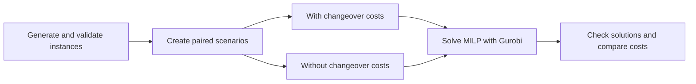

# A MILP approach to solve the Multi-product Vehicle Routing Problem with Changeover Costs (MPVRP-CC)

## Project owner

**Rosas Behoundja** · [Website](https://rosasbehoundja.github.io/) · [perrierosas@gmail.com](mailto:perrierosas@gmail.com)

## Project overview

The Multi-Product Vehicle Routing Problem with Changeover Costs concerns deliveries of several products from depots with stock to stations with specified demands, using capacitated vehicles. A vehicle may make several trips during the planning period. On each trip, it loads one product at a depot, visits stations requiring that product, and delivers its entire load before loading again. The next trip may start at another depot. Each used vehicle leaves its home garage and returns there after its final delivery.

Successive loads may require preparation. The changeover cost depends on the previous and next products, while the vehicle's initial product state determines the preparation before its first load. The model chooses delivery quantities, loading depots, vehicle assignments, and operation order to satisfy all demand while minimizing travel and changeover costs. The shortest route is therefore not always the least expensive plan.

## Methods, design and evaluation



The paired instances share demands, depots, vehicles, and travel data; the second scenario sets changeover costs to zero. Benchmark reports record solution status and objective values. Zero-cost solutions can also be repriced using the original changeover matrix.

## Tools

- Python 3.12.3 (the project requires Python 3.12 or newer)
- Gurobi 13.0.1 solver and a working Gurobi license
- 100 benchmark instances with varied configurations

## Files

| Path | Purpose |
| --- | --- |
| `src/milp/` | MILP model, solver, and instance/solution I/O |
| `src/tools/` | Instance generation, validation, scenario pairing, benchmark solving, and repricing |
| `data/instances/` | Generated and paired benchmark instances |
| `data/solutions/milp/` | Solver solutions and benchmark reports |
| `docs/` | Problem description and file format documentation |
| `results/logs/` | Command logs |
| `tests/` | Automated checks |

See [data/README.md](data/README.md) for the detailed data layout.

## Setup instructions

Install Python 3.12 or newer, [uv](https://docs.astral.sh/uv/), and configure a Gurobi license. From the project directory, install dependencies and run the checks:

```bash
uv sync
uv run pytest
```

Generate and validate an example instance:

```bash
uv run mpvrp-generate -v 5 -d 2 -g 2 -s 12 -p 3 --id S_001
uv run mpvrp-validate data/instances/generated/MPVRP_S_001_s12_d2_p3.dat
```

Generate the 100-instance benchmark and paired zero-cost scenarios, then solve both:

```bash
uv run mpvrp-generate-benchmark --count 100
uv run mpvrp-prepare-scenarios --force
uv run mpvrp-solve-benchmark --scenario with_changeover_costs --time-limit 190
uv run mpvrp-solve-benchmark --scenario without_changeover_costs --time-limit 190
```

Use `--force` with benchmark generation to replace existing instance files. To resume a reported solve run, add `--resume`; reported attempts, including unsolved ones, are skipped. To reprice a zero-cost solution with the original changeover costs, run:

```bash
uv run mpvrp-reevaluate-changeovers data/solutions/milp/out/Sol_003_s37_d2_p2.dat
```

The repriced copy is written to `data/solutions/milp/out/recomputed/`. Commands write logs under `results/logs/`.

## Useful links

- [Problem definition](docs/problem.md)
- [Instance format](docs/instance_format.md)
- [Solution format](docs/solution_format.md)
- [Data layout](data/README.md)
- [Gurobi Python documentation](https://docs.gurobi.com/projects/optimizer/en/current/reference/python.html)

## Contributors

- Vinasétan Ratheil Houndji — [vratheilhoundji@gmail.com](mailto:vratheilhoundji@gmail.com)
- Jean-Eudes Codo — [eudescodo00@gmail.com](mailto:eudescodo00@gmail.com)
- Godright Adohounblessi — [adohounblessirobert@gmail.com](mailto:adohounblessirobert@gmail.com)
- Fédel Folly — [follyfedel@gmail.com](mailto:follyfedel@gmail.com)
- Marc-André Akouete — [christnam29@gmail.com](mailto:christnam29@gmail.com)
