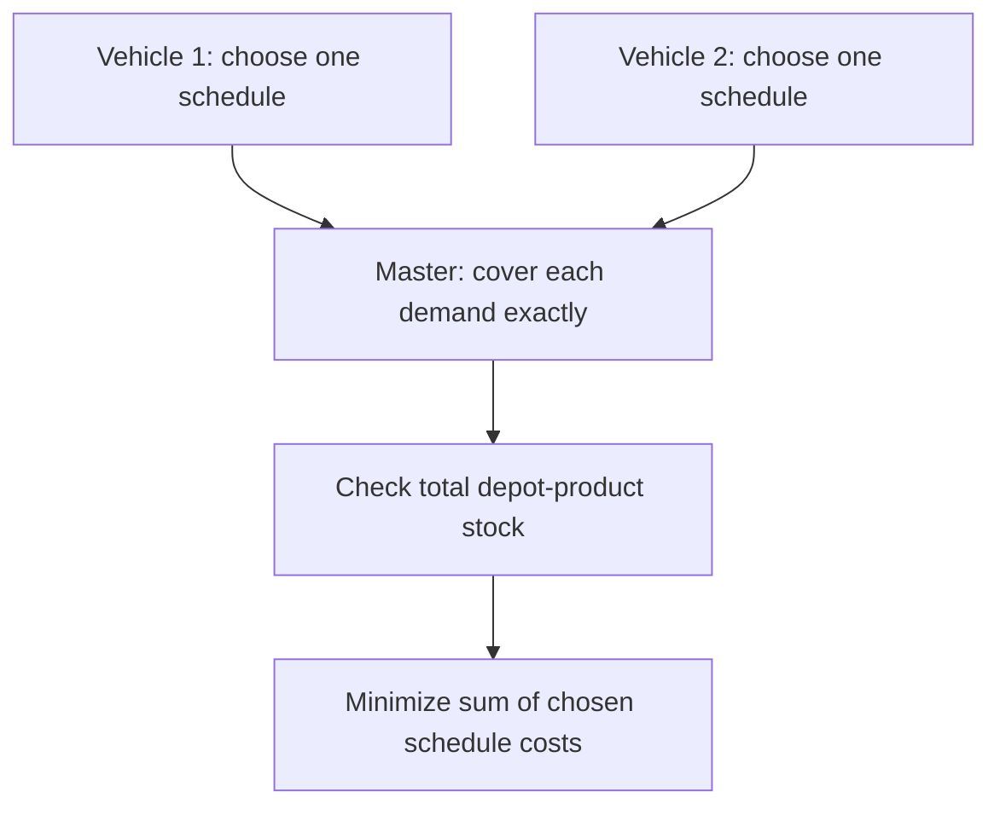
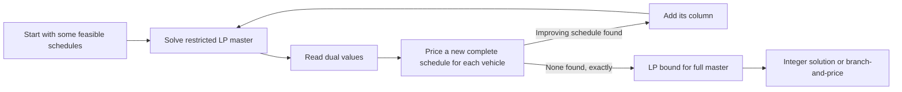

# Modeling MPVRP-CC with complete vehicle schedules as columns

This note explains an alternative to the trip-indexed MILP in [`src/milp/solver.py`](../src/milp/solver.py). It is a modeling idea, not an implemented solver. The central decision changes from **“what happens in trip slot 1, 2, …?”** to **“which complete schedule does each vehicle execute?”**

## 1. What is a column?

In mathematical programming, a *column* is one variable together with its coefficients in the constraints and objective. Here, one column is **one feasible, complete schedule for one specific vehicle**, from its home garage back to that garage. A schedule may contain any number of loading trips. For example:


This **one** column contains two trips. It specifies the depot and product for each loading, the station order, every delivered quantity, and the return home. Its cost includes every rounded travel arc, the transition from the vehicle's initial configuration to A, and the transition from A to B. Loading A again on a later trip would also incur the diagonal transition cost `C[A,A]`.

There is also an implicit *idle schedule* for each vehicle: stay at the garage, deliver nothing, use no stock, cost zero.

### A column as a row of data

For vehicle `k`, a schedule `s` can be summarized by:

| Symbol | Meaning |
| --- | --- |
| `c[k,s]` | Total travel and loading-transition cost of the complete schedule |
| `a[r,k,s]` | Quantity delivered to request `r` across the schedule |
| `b[d,k,s]` | Quantity loaded from depot-product node `d` |
| `z[k,s]` | Binary decision: choose this schedule for vehicle `k` |

The ordered path and deliveries are retained with the column so they can be written to a solution file. The master optimization uses only the summary coefficients.

## 2. A small example

Suppose there are two vehicles, each with capacity 6. Request `A1` needs 8 units of product A and `B1` needs 3 units of product B. Depot A has at least 8 units and depot B at least 3. Each vehicle may serve `A1` only once. Imagine these candidate schedules; their costs are illustrative, not computed from coordinates:

| Column | Complete schedule | `A1` delivered | `B1` delivered | Cost |
| --- | --- | ---: | ---: | ---: |
| `s1` for vehicle 1 | Garage → depot A → A1 (6) → garage | 6 | 0 | 18 |
| `s2` for vehicle 1 | Garage → depot A → A1 (5) → depot B → B1 (3) → garage | 5 | 3 | 35 |
| `s3` for vehicle 2 | Garage → depot A → A1 (2) → garage | 2 | 0 | 14 |
| `s4` for vehicle 2 | Garage → depot A → A1 (3) → garage | 3 | 0 | 15 |

Choosing `s2` and `s4` delivers `5 + 3 = 8` units of A and `3` units of B. Choosing `s1` and `s3` delivers all A but leaves B unmet. The master chooses combinations using these numbers; it does not reconstruct the path from arc variables.



## 3. The master problem

Let `R` be positive-demand station-product requests, `D` the depot-product nodes, `K` the vehicles, and `Ω_k` all feasible complete schedules for vehicle `k`. Excluding the idle schedule, the integer master is:

```text
minimize    Σ_k Σ_(s in Ω_k) c[k,s] z[k,s]

subject to  Σ_k Σ_(s in Ω_k) a[r,k,s] z[k,s] = demand[r]   for every r in R
            Σ_k Σ_(s in Ω_k) b[d,k,s] z[k,s] ≤ stock[d]     for every d in D
            Σ_(s in Ω_k) z[k,s] ≤ 1                         for every k in K
            z[k,s] ∈ {0,1}
```

The first constraint permits **split delivery between vehicles** because two chosen schedules may contribute quantities to the same request. The second aggregates loading from all visits to a depot-product node. The third gives a vehicle at most one complete schedule. An idle vehicle has all its `z` values zero.

Feasibility rules *inside* each candidate schedule include: capacity on each trip; one product per trip; a depot loading before its deliveries; positive delivery at every station visit; no more than one visit to a given station-product request by that vehicle over its entire schedule; and departure from and return to its own garage. The first loading uses the vehicle's initial product configuration. These are exactly the features that make a candidate schedule valid for this problem.

## 4. Where did the trip bound go?

The master has no index `t = 0,…,T-1`, so it does not need a chosen trip-slot horizon. A column may represent one trip, two trips, or more. **This does not make the set of schedules small.** `Ω_k` is generally enormous, so listing every schedule up front is usually impractical.

The set is still finite under this problem's rules. With strictly positive delivery on every trip and at most one service of each request by a vehicle, each trip consumes at least one previously unserved request. Thus a complete vehicle schedule has at most `|R|` trips. This is an *implicit mathematical limit*, not a trip horizon imposed on the master. The current code has its positive-delivery constraint commented out; that constraint, or an equivalent schedule-validity rule, matters for this argument.

There is a trade-off: the trip-indexed MILP explicitly builds many possible trip slots, whereas the schedule model hides their combinatorial possibilities in `Ω_k`. It does not remove the intrinsic difficulty of choosing and ordering trips.

## 5. How column generation avoids enumerating everything

Column generation begins with a small collection of schedules. It solves the **linear relaxation** of the master (`0 ≤ z ≤ 1`) and reads the dual values of the demand, stock, and vehicle constraints. A separate *pricing problem* searches for another feasible complete schedule whose addition could improve that relaxation. If one is found, add its column and repeat.



The pricing problem must choose a path, its loading stops and products, and delivery amounts. It evaluates travel plus directed transition costs. In this MPVRP-CC, pricing is particularly hard because a vehicle may make several trips, quantities may be split across vehicles, and the same vehicle cannot serve a request twice. A pricing state may need the current location, current product configuration, quantity currently carried, and the set of requests already served by that vehicle. The latter set can make exact dynamic programming expensive.

The LP result is generally fractional: for example, it might choose half of two schedules for the same vehicle. Solving a binary master over the columns found so far gives a **feasible candidate**, but does not prove global optimality. An exact method needs valid pricing at every branch-and-bound node: *branch-and-price*. A heuristic can generate a useful pool of schedules and solve the binary master over that pool without claiming an optimality proof.

One practical issue is initialization. The restricted master needs feasible columns or artificial variables with a penalty to cover all requests while columns are being generated. Artificial variables must disappear before a solution is accepted as feasible for the original problem.

## 6. Relationship to the current solver

| Current [`solver.py`](../src/milp/solver.py) | Complete-schedule model |
| --- | --- |
| `active[k,t]`, `start[k,t,d]`, `arc[k,t,i,j]`, `quantity[k,t,r]` decide a trip in slot `t` | One `z[k,s]` selects a whole vehicle schedule whose arcs and quantities are already fixed |
| `change[k,t,p,q]` links adjacent trip slots | Every loading transition is priced while constructing the schedule |
| `max_trips_per_vehicle` sizes variables and constraints | No trip-slot index in the master; pricing explores feasible schedules |
| Depot stocks and demand couple all vehicle trips | Depot stocks and demand couple selected columns |

For an incremental implementation, a **schedule-pool heuristic** is a useful first step: generate many valid complete schedules with your existing routing logic or a constructive search, calculate each column's four pieces of data, and solve the binary master. It tests the formulation without requiring an exact pricing algorithm. Then add LP duals and pricing if needed. Treat a missing schedule as a possible improvement, not as evidence that the restricted master is optimal for the original problem.

## 7. Related literature

These works contain related ideas; none should be read as an exact formulation of this benchmark's combination of product transitions, split deliveries, depot stocks, and request-level revisit rules.

1. **Hernandez, Feillet, Giroudeau, and Naud (2016), “Branch-and-price algorithms for the solution of the multi-trip vehicle routing problem with time windows.”** The paper explicitly compares columns representing a *sequence of consecutive trips* with columns representing *single trips*. The first is the closest precedent for the complete-schedule idea here. [Institutional publication page](https://pure.etsmtl.ca/en/publications/branch-and-price-algorithms-for-the-solution-of-the-multi-trip-ve/).
2. **Jin, Liu, and Eksioglu (2008), “A column generation approach for the split delivery vehicle routing problem.”** Their route columns include both a path and delivered quantities. This is the closest precedent here for quantities being coefficients of a column rather than only binary visit flags. [Journal page and abstract](https://www.sciencedirect.com/science/article/pii/S0167637707000909).
3. **Feillet (2010), “A tutorial on column generation and branch-and-price for vehicle routing problems.”** A general introduction to route-based master problems, pricing, and the step from column generation to exact integer optimization. [Bibliographic record and DOI](https://dblp.org/rec/journals/4or/Feillet10).
4. **“A Branch-and-Price algorithm for two multi-compartment vehicle routing problems” (2019).** Related multi-product routing with branch-and-price, but its compartment and customer-service rules differ from this problem's one-product-per-trip and split-delivery rules. [Open-access journal page](https://www.sciencedirect.com/science/article/pii/S2192437620300546).

## 8. Figures worth drawing for a report or presentation

The Mermaid diagrams above render in Markdown viewers that support Mermaid. For a static image, the following two figures would be particularly useful:

1. **Trip slots versus one schedule column.** On the left, draw three boxes `t=1,2,3` with optional/empty slots. On the right, draw one garage-to-garage path with two colored product trips. Caption: “The schedule variable selects the entire path; it has no trip-slot index.”
2. **Column coefficient matrix.** Put requests, depot stocks, and vehicle-choice constraints on rows; put four candidate schedules on columns. Highlight the entries for `a[r,k,s]`, `b[d,k,s]`, and the vehicle indicator. Caption: “One path becomes one column of numbers in the master problem.”

The worked example and its table in §2 provide the data for the second figure. These would be explanatory drawings of this formulation, rather than figures reproduced from a paper.
